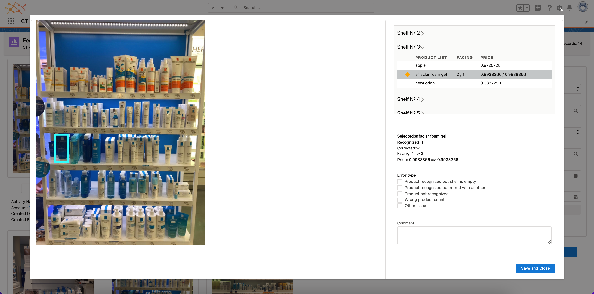
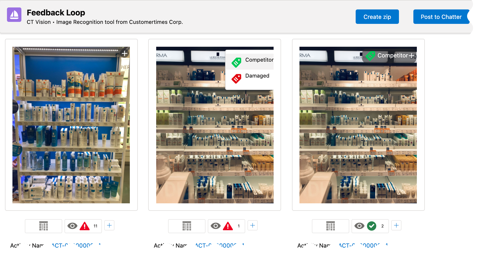

= Corrections in Shelf Product List

Click
the 
button to
open link:working-with-ct-vision-in-salesforce.html#h3_1017582017[the
Shelf Product List] with recognized products to verify the product
quantity on the shelves.
[TIP]
====
To set up fields to display, refer to link:vision-product-list-field-reference.html[Vision Product List Field Reference].
====

* The color mark next to the product is responsible for
link:working-with-ct-vision-in-the-ct-mobile-app.html#h2_691734370[the
status of recognition].
* Click the product:
** The selected products are framed in the photo.
** Select the error and add a comment if needed. Available errors:
*** Product recognized but the shelf is empty
*** Product recognized but mixed with another
*** Product not recognized
*** Wrong product count
*** Another issue

[[h3_491461789]]
=== Photo Tags 

[width="100%",cols="50%,50%",]
|===
a|
To add a photo tag:

. Hover the cursor over the *Plus* icon in the upper right corner of the
photo.
. ​Select one or more photo tags.

The tag is added.

|
|===
